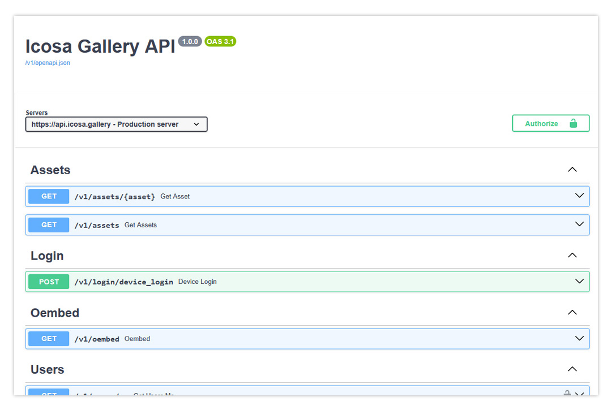
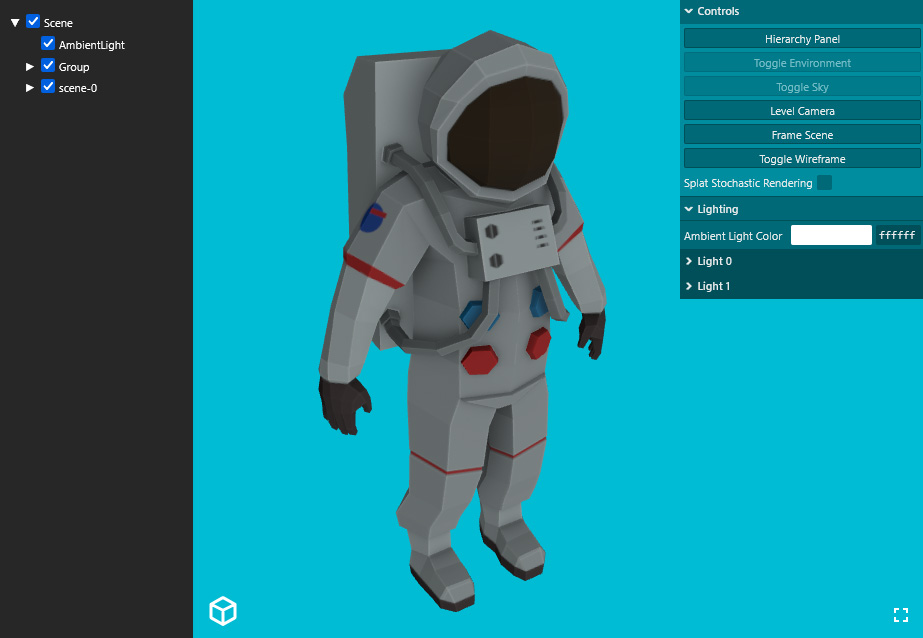
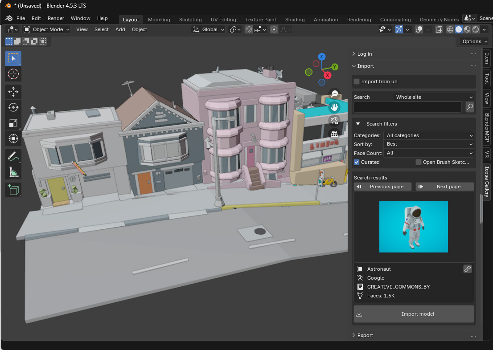
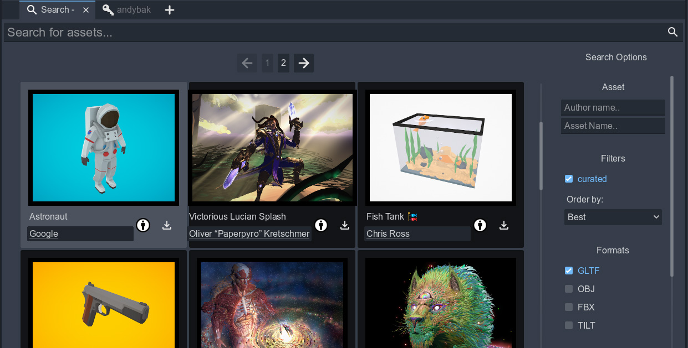

# Icosa Gallery

Icosa Gallery is an open source 3D model hosting solution, intended as a replacement for the defunct [Google Poly](https://en.wikipedia.org/wiki/Poly_(website)).

It's designed to be easy to self-host and customize. We hope organizations and individuals will run their own instances to host and share 3D models.

Our official instance is available at [https://icosa.gallery](https://icosa.gallery) and we have attempted to restore as much public content from Poly as possible. We'd like to thank [Archive Team](https://wiki.archiveteam.org/) volunteers for their timely preservation work and the [Internet Archive](https://archive.org) for hosting the historically valuable work.

We aim to develop integration into a wide range of apps and platforms and current integrations including [Open Brush](https://openbrush.app), [Open Blocks](https://openblocks.app), [Blender](https://blender.org) and [Godot](https://godotengine.org). See the section below on "Clients, plugins and integrations" for more info.

## Philosophy and Tech Stack

The backend code is built on Django - a clean, mature and stable web framework with a strong ecosystem.

We aim to avoid heavy javascript frameworks on the front end as we are firm believers in [progressive enhancement](https://en.wikipedia.org/wiki/Progressive_enhancement). We mainly use vanilla JS with a light scattering of HTMX where it is useful.

Docker is currently used for deployment and development but we are working to become agnostic about deployment technologies.

We currently support PostgreSQL as the database backend but this is not a hard dependency and it should be simple to swap out your relational database of choice (from local tests SQLite seems perfectly viable)

* [Docker Compose](https://docs.docker.com/compose/)
* [Django](https://www.djangoproject.com/)
* [PostgreSQL](https://www.postgresql.org/)
* [Django Ninja](https://django-ninja.rest-framework.com/)
* [HTMX](https://htmx.org/)
* [three.js](https://threejs.org/)

## Getting Started

> [!NOTE]
> This codebase is not currently at a stable release and we may still perform some significant refactoring. If you plan to fork Icosa Gallery to customize it for your own needs then we recommend you get in touch so we can keep you informed of anything you might need to know ahead of time. 

See [the installation guide](docs/INSTALL.md) for details.

## API

The official instance of the Icosa Gallery has OpenAPI docs here: [https://api.icosa.gallery/v1/docs](https://api.icosa.gallery/v1/docs).

If you deploy your own instance the docs will be at `api.yoursite.com/v1/docs/` or `yoursite.com/api/v1/docs/` depending on your configuration.

## Clients, plugins and integrations

### Open Brush

Browsing and publishing is built in directly to [Open Brush](https://openbrush.app)

### Open Blocks

Browsing and publishing is built in directly to [Open Blocks](https://openblocks.app)

### Web

* Three.js based viewer: [Gallery Viewer](https://github.com/icosa-foundation/gallery-viewer)
* Open Brush Material Importer (used by gallery-viewer): [three-icosa](https://github.com/icosa-foundation/three-icosa)

We would like to add support for [Babylon.js](https://www.babylonjs.com/) and [PlayCanvas](https://playcanvas.com/) based viewers in the future. If you are interested in helping with this please get in touch.

### Unity 

Asset browser and importer for editor and runtime: [Icosa Toolkit Unity](https://github.com/icosa-foundation/icosa-toolkit-unity)

### Blender

Plugin for browsing and importing assets from Icosa Gallery: [Icosa Gallery Blender Plugin](https://github.com/icosa-foundation/icosa-blender-plugin)

### Godot

Asset browser and importer for editor and runtime: [Godot Addon](https://github.com/icosa-foundation/icosa-godot-addon)

### Hubs

We have pull requests to integrate Icosa Gallery as an asset source in [Hubs](https://hubsfoundation.org/):

https://github.com/Hubs-Foundation/Spoke/pull/1301
https://github.com/Hubs-Foundation/reticulum/pull/723

## Funding

This project is funded through [NGI0 Entrust](https://nlnet.nl/entrust), a fund established by [NLnet](https://nlnet.nl) with financial support from the European Commission's [Next Generation Internet](https://ngi.eu) program. Learn more at the [NLnet project page](https://nlnet.nl/project/IcosaGallery).

